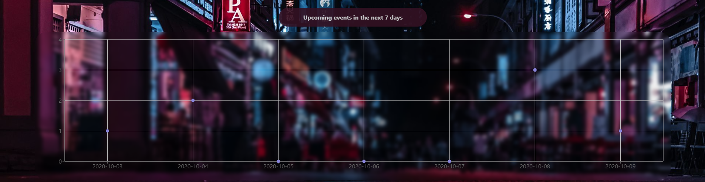
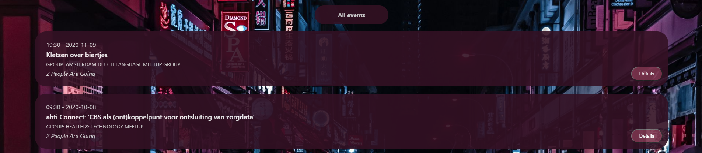
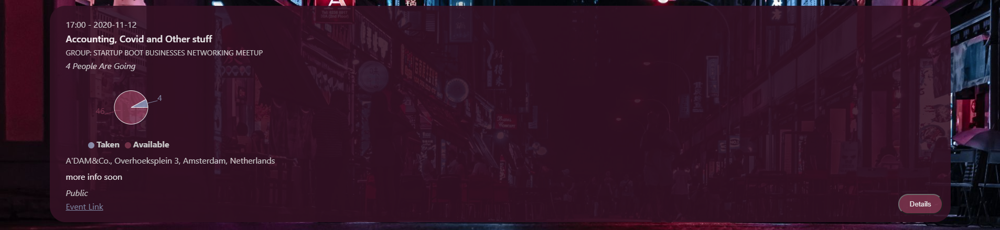

# MeetUp App

## About
MeetUp application created by create-react-app, utilizing a serverless backend with AWS Lambda and fetching events from the MeetUp API. See the **hosted project** [here](https://lillapulay.github.io/meetup/).  

  
The app visualizes the number of events coming up in the next 7 days and shows a list of all events in a certain location.  

  
Further details can be accessed by clicking the "Details" button. If available in the database, the app renders a pie chart with the number of spots taken/available at the event. 

  
This project was part of the CF Full-Stack Web Development course. 

The app was built into a **Progressive Web Application (PWA)** and passed Lighthouse's PWA checklist. During the process, it required gaining experience with **Continuous Delivery and Intergration**, and **Object-Oriented Programming**. The app has **offline availability** with the help of a service worker, includes **data visualisation** (number of events) and uses the **OAuth2 authentication** flow. The API calls are made with Axios and use asynchronous functionality. The app used Atatus for Application Performance Monitoring (trial version).  
 

## Testing
The goal of this project was to practice different testing methods and thus included:
- Unit Testing
- Integration Testing
- Acceptance Testing
- End-to-End Testing.

You can see the **test scenarios** on [this link](https://lillapulay.dev/files/Test_Scenarios.pdf).

### Testing tools
- "enzyme",
- "enzyme-adapter-react-16",
- "jest-cucumber",
- "puppeteer"

## User stories

  
1. As a user, I would like to be able to filter events by city so that I can see the list of events that take place in that city.
2. As a user, I would like to be able to show/hide event details so that I can see more/less information about an event.
3. As a user, I would like to be able to specify the number of events I want to view in the app so that I can see more or fewer events in the events list at once.
4. As a user, I would like to be able to use the app when offline so that I can see the events I viewed the last time I was online.
5. As a user, I would like to be able to add the app shortcut to my home screen so that I can open the app faster.
6. As a user, I would like to be able to see a chart showing the number of upcoming events in a city by date so that I know on which days I can attend Meetup events.

## Key features
Extracted from the user stories above, the following requirements were laid out:
1. Filter events by city.
2. Show/hide event details.
3. Specify number of events.
4. Use the app when offline.
5. Add app shortcut to the home screen.
6. View a chart showing the number of upcoming events by date

## Dependencies
- "axios",
- "react",
- "react-dom",
- "react-scripts"

### Updates:
- [x] Styling (background image, logo, personal logo, titles, color, scrollbar)
- [x] Pie chart placement (only when "Details" are visble)
